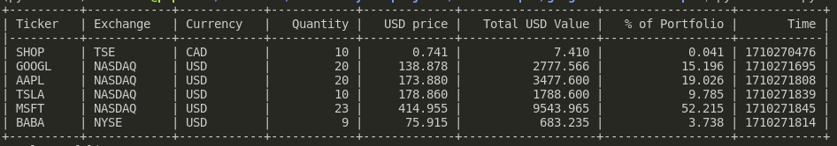

# Google-Finance-Scraper

A simple scraping project that scrapes real-time stock data from Google Finance using *BeautifulSoup*. Data structuring is done through the use of *dataclasses*. The script calculates portfolio valuation and stores data into a SQLite database using *sqlite3* for future analysis.

# Features
- **Real-Time Price Updates**: The script fetches the latest prices from Google Finance.
- **Currency Conversion**: The script standardizes all prices to USD. This allows portfolios to be evaluated more easily regardless of the original stock currency.
- **SQLite Database Integration**: Stores portfolio information in a SQLite database for future analysis of historical data. Using SQLite databases is also a more scalable alternative to traditional methods like csv.

# Screenshot

# Future Work
The initial scope for the project was to practice web-scraping and database modeling, so I stopped the project after that was done. However, to take this project further, we could:

- Create a frontend using Flask or Streamlit that allows users to add and remove stocks from their portfolios.
- Use the data stored to create a timeseries for the portfolio to allow users to analyze how their portfolio has changed over time. This is possible because timeseries data is stored in the database, so we can use modules like Plotly or Matplotlib to create timeseries plots.
- Include error handling and better user feedback.
